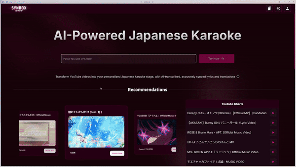
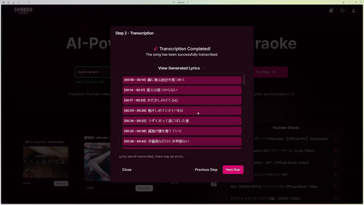

  

  
  

  Effortlessly transcribe, translate, and annotate Japanese song lyrics from YouTube with AI, enhancing your viewing experience.  
   
   
View the <a href="https://github.com/lifuhh/synbox-transcribe-whisper"  target="_blank" rel="noopener noreferrer">backend repository</a> here
   
   
  <a href="https://synbox.io" target="_blank" rel="noopener noreferrer"><strong>Visit Website »</strong></a>
   
   
  <a href="https://github.com/lifuhh/synbox">Explore the Docs</a> · 
  <a href="https://github.com/lifuhh/synbox/issues" target="_blank" rel="noopener noreferrer">Report Bug</a> · 
  <a href="https://github.com/lifuhh/synbox/issues" target="_blank" rel="noopener noreferrer">Request Feature</a>

---

## Table of Contents
- [Motivation](#motivation)
- [Features Showcase](#features-showcase)
- [Infrastructure / Technologies](#infrastructure--technologies)
- [Contacts](#contacts)
- [License](#license)

## **Motivation**

As someone who loves Japanese music and culture but has only a basic understanding of the language, I’ve often struggled with the lack of proper translations, romaji, or furigana in many Japanese music videos on YouTube. Singing along or truly connecting with the lyrics felt nearly impossible.

This frustration inspired me to create Synbox — a tool that helps fans like me enjoy Japanese music on a deeper level by providing customizable overlays with translations, romaji, and furigana annotations, all while preserving the experience of the original music video.

## **Features Showcase**

🔊 **Accurate Transcriptions** - Leverage the latest OpenAI Whisper model to transcribe any Japanese song with precision.  

  

-

🎵 **Discover New Music** - Explore a landing page with a carousel, an infinite scroll gallery, and links to top songs played in Japan, curated from YouTube’s popular playlists.  

  

-

### **Smart Lyrics Transcription**

🎶 **Smart Lyrics Transcription** - Core feature of Synbox, delivering advanced, multi-step processes for generating highly accurate Japanese lyrics with translations and annotations.
⚡ **Real-Time Updates** - Live progress streaming for immediate feedback, ensuring a seamless user experience.  
🔄 **Smart Retries** - Automatic 3-attempt retry system with timeout protection.  

<h5 align="center">Transcription</h5>

  

🎯 **Intelligent Detection** - Automatically detects and utilises existing YouTube subtitles.  

🤖 **OpenAI Transcription** - Uses the Whisper model for precise transcription when subtitles aren't available.  

<h5 align="center">Translation & Annotation</h5>

  

📝 **Complete Language Support** - Japanese lyrics are annotated with Romaji and Furigana annotations to provide a tailored viewing experience that meets the needs of diverse users.  

-

⚙️ **Customizable Lyrics Overlay** - Adjust the size, position, and appearance of the lyrics overlay to match your preferences and the music video’s styling.  

  

-

📌 **History and Bookmarks** - Keep track of your favorite songs with history and bookmark features, ensuring easy access to revisit and enjoy.  

  

## **Infrastructure / Technologies**

| **Category**          | **Technologies**                                                   |
|------------------------|--------------------------------------------------------------------|
| **Frontend**          | React, TypeScript, TailwindCSS, ShadCN UI, Vite                                    |
| **Backend**           | Python, Flask                                                    |
| **APIs**              | OpenAI API, Google Cloud APIs                                    |
| **Database**          | Appwrite                                                         |
| **Deployment**        | Netlify (frontend), Google Cloud Run (backend)                    |
| **Other Tools**       | ESLint, Prettier, Bun                                      |

### **System Architecture**

Synbox leverages a cutting edge full-stack architecture, combining a user-friendly frontend with powerful backend capabilities for seamless AI-driven transcription, translation, and annotation.

**Frontend** - Built with React, TypeScript, and TailwindCSS, the frontend provides a dynamic and responsive interface. Features include a landing page with an infinite scroll gallery, customizable lyrics overlays, viewing history and bookmarks.  

**Backend** - Powered by Flask and Python, the backend processes AI requests, including OpenAI Whisper model-based transcription, translation, and annotation.  

**Database** - Appwrite serves as the backend's database, handling storage of generated lyrics.

**APIs and Integrations**  
**OpenAI API** - For transcription, translation, and annotation of Japanese song lyrics.  
**Google Data API** - Integrates YouTube data to fetch popular Japanese playlists and user-submitted video links.  

**Hosting and Deployment**  
**Frontend** - Hosted on **Netlify**, ensuring fast and reliable delivery.  
**Backend** - Runs on **Google Cloud Run**, offering scalable and efficient serverless deployment.  

This architecture ensures Synbox remains fast, responsive, and capable of delivering a rich user experience while handling computationally intensive AI tasks in the backend.

## **Contacts**

Feel free to reach out for feedback, issues, or contributions:

**Lifu**: [LinkedIn](https://www.linkedin.com/in/lifuhh)
**GitHub Issues**: [Report issues](https://github.com/lifuhh/synbox/issues)

## **License**

This project is licensed under a **Personal Use License**.  
You may view and explore the codebase for personal learning purposes. Redistribution, modification, or commercial use is prohibited without explicit permission from the author.